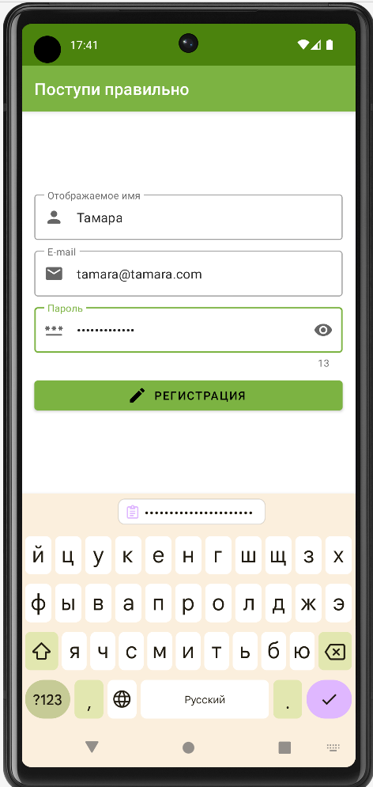
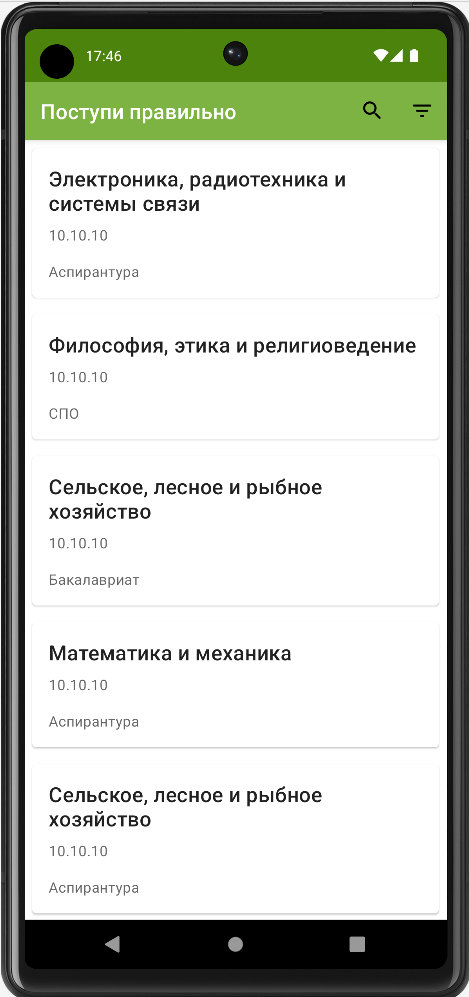
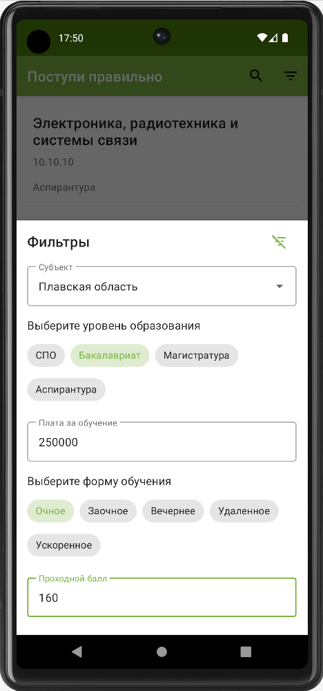
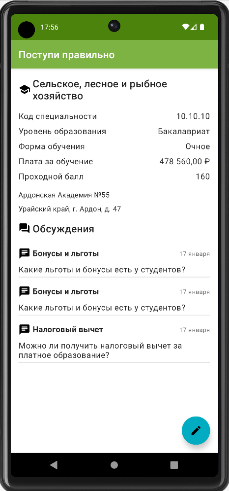
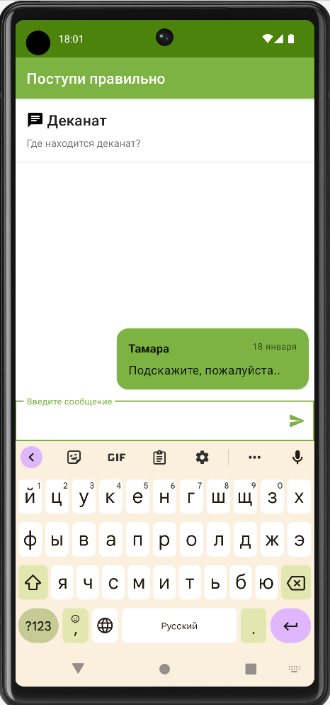

# Поступи правильно

## Описание
Учебный проект Android приложения для помощи абитуриентам в выборе учебного заведения, поступления. Пользователь может создавать обсуждения, задавать вопросы по интересующему направлению подготовки и получать ответы.

В качестве серверной части приложения использовалась облачная платформа Firebase, а именно аутентификация для регистрация пользователей и Realtime Database для хранения данных.

## Скриншоты
Экран регистрации пользователя

Экран поиска направления подготовки

Экран с фильтрами поиска

Экран с информацией о направлении подготовки и списком обсуждений

Экран с созданным обсуждением

